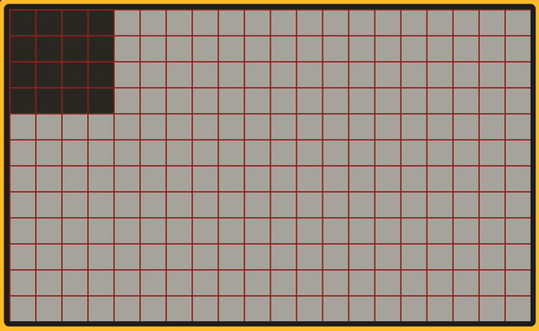

# playdate-1offscreen

Bug reproduction repo demonstrating a position off by 1 bug occurring when
playdate sprites have a negative x or y position (center of sprite is offscreen).

This occurs with the default sprite position behavior: `:setCenter(0.5,0.5)`

This does not occur if `:setCenter(0.5,0.5)` is used.

## Demo

The rectangle sprite should line up with the grid when moved.
If the sprite's x or y become negative (center of the sprite is offscreen)
the drawn rectangle is shifted one pixel and does not align with the grid.

This was discovered with Playdate SDK 1.12.3 (2022-08-16).

## More info

Links:
* [Playdate dev forum thread](https://devforum.play.date/t/playdate-sprite-position-off-by-1-bug/8312)
* [@notpeter on twitter](https://twitter.com/notpeter)
* [@notperer on reddit](https://reddit.com/u/notpeter)
